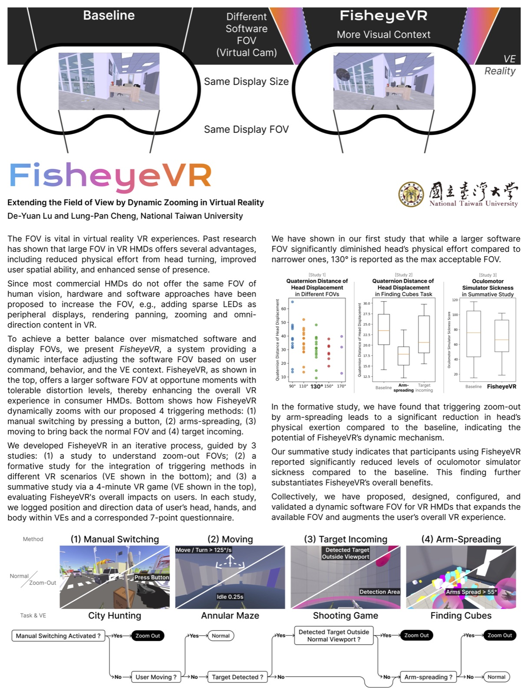

# FisheyeVR

FisheyeVR is an archived research prototype that explores dynamic zooming and
field-of-view transitions in virtual-reality head-mounted displays. This
repository is a public-facing source snapshot of the Unity prototype and its
research analysis pipeline.

## Publication

This repository accompanies the following paper:

> De-Yuan Lu and Lung-Pan Cheng. 2024. FisheyeVR: Extending the Field of View
> by Dynamic Zooming in Virtual Reality. In *Adjunct Proceedings of the 37th
> Annual ACM Symposium on User Interface Software and Technology (UIST
> Adjunct '24)*. ACM, Article 114, 3 pages.
> <https://doi.org/10.1145/3672539.3686316>

Use the metadata in [`CITATION.cff`](CITATION.cff) when citing this research
artifact.

## Research poster

[](docs/assets/fisheyevr-poster.jpg)

The poster summarizes the FisheyeVR concept, its three user studies, and the
four dynamic zooming methods explored in the prototype. Select the preview to
open the full-resolution poster.

## Repository status

This is a research artifact, not a supported product or a turnkey replication
package. The original study used a Meta Quest 2 and Unity 2021.3.16f1. The
repository has not been validated on newer Unity, Python, or headset versions.

Two important classes of material are intentionally absent:

- Raw and derived participant data are excluded for privacy. Notebook outputs
  and execution state have also been cleared.
- Unity Asset Store packages and other third-party source assets are excluded
  because this repository does not grant redistribution rights for them.

The retained Unity scenes therefore contain unresolved references until a user
with the appropriate licenses restores compatible dependencies. See
[Third-party dependencies](THIRD_PARTY_NOTICES.md) for details.

## Prototype interactions

The prototype explored several ways to trigger a wider view:

- manual activation from a controller;
- arm-spreading gestures;
- target-proximity and target-visibility cues; and
- returning to the standard view while moving.

The Unity source includes the project-owned scripts, shader, configuration, and
selected research scenes. The analysis source includes the CHI 2024 and UIST
2024 notebook pipelines used to parse motion logs, aggregate conditions, and
calculate questionnaire and statistical summaries.

## Repository layout

| Path | Contents |
| --- | --- |
| [`unity/`](unity/) | Partial Unity 2021.3.16f1 project with project-owned source and selected scenes |
| [`analysis/`](analysis/) | Python scripts and output-cleared notebooks for the study analyses |
| [`docs/PUBLICATION_AUDIT.md`](docs/PUBLICATION_AUDIT.md) | Public-release decisions, remaining blockers, and verification ledger |

## Unity prototype

1. Install Unity Editor `2021.3.16f1` through Unity Hub.
2. Acquire compatible copies of the excluded dependencies listed in
   [`THIRD_PARTY_NOTICES.md`](THIRD_PARTY_NOTICES.md). Import them using their
   original GUIDs where possible.
3. Open the [`unity/`](unity/) directory as a Unity project.
4. Allow Unity Package Manager to resolve [`unity/Packages/manifest.json`](unity/Packages/manifest.json).
5. Inspect `Assets/Scenes/FisheyeVR_Demo.unity`.

The exact versions of the removed Asset Store packages were not recorded, so a
clean import or build is not currently reproducible from this repository alone.
See [`unity/README.md`](unity/README.md) before opening the project.

## Analysis pipeline

The analysis snapshot was developed with Python 3.9. Create an isolated
environment before installing the unpinned historical dependencies:

```bash
cd analysis
python3 -m venv .venv
source .venv/bin/activate
python -m pip install --upgrade pip
python -m pip install -r requirements.txt
```

Place only locally authorized, pseudonymized inputs under `analysis/data/`.
That directory is ignored by Git except for its documentation. For example:

```bash
cd analysis/CHI24
python report_formal.py \
  --file ../data/chi24/formal/P001/LOG_Formal_P001_city_Static_0.txt
```

See [`analysis/README.md`](analysis/README.md) for the notebook map and data
handling rules. The original participant data are not required to inspect the
code, but they are required to reproduce the numerical study results.

Run the local, non-networked publication gate at any time:

```bash
python3 scripts/check_public_tree.py
```

## Contributing and security

Read [`CONTRIBUTING.md`](CONTRIBUTING.md) before proposing changes. Never submit
participant data, credentials, local paths, licensed Asset Store source, or
notebook outputs. Report security or privacy issues using the process in
[`SECURITY.md`](SECURITY.md).

## License

Project-authored source code and documentation are available under the
[MIT License](LICENSE). This license does not relicense excluded or third-party
content; those components remain subject to their own terms. See
[`THIRD_PARTY_NOTICES.md`](THIRD_PARTY_NOTICES.md).
